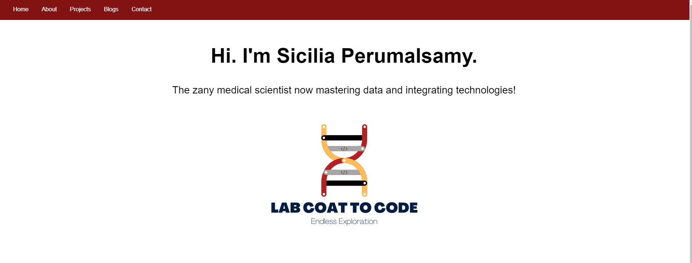
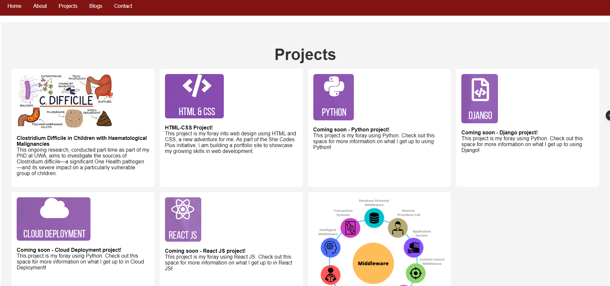

#  Sicilia Perumalsamy - Portfolio Task
​
[My portfolio site](link_to_your_site)
​
## Project Requirements

### Content
I used a headshot (which I took on the first day of my tech role at KPMG Aus!) and created my own logo which can be seen in my Home page (would like to keep improving this but gave it a go and I used Canva). I didn't really want to say too much about myself on the Home page and left everything to the About me section.  My contact form is working however I had trouble dealing with spacing issues - I think there's alot of white space overall in that page, especially under /Contact me'. I would like to do better with the projects page, I think I will probably redo the whole thing over the next few months. Initially, I had a black background and then scratched that idea and went for a white background but I may go back to my initial idea again - who knows! All the links to external sites are working. I have linked to my linked In profile, GitHub repository and Orcid (which is like a LinkedIn equivalent for academics)

- [x] At least one profile picture
- [x] Biography (at least 100 words)
- [x] Functional Contact Form
- [x] "Projects" section
- [x] Links to external sites, e.g. GitHub and LinkedIn.
​
### Technical
I have developed 5 webpages I think. A main landing page which has links that bring you to the various other sections, such as About me, Projects, Blogs and Contact. I think I have done the version controlling with Git - but Git scares me so I may be wrong here. My pages are now deployed on GitHub Pages. My website is fully responsive on mobile and laptop screens (I think). I developed for desktop first and then used media queries to make it work on smaller screens.

- [x] At least 2 web pages.
- [x] Version controlled with Git
- [x] Deployed on GitHub pages.
- [x] Implements responsive design principles.
- [x] Uses semantic HTML.

### Bonus (optional)
I tried a couple of things here, tried to get a head start with Javascript and even downloaded a Js repository from Git to learn how to do it and attempted to have a go the text "The zany medical scientist now mastering data and integrating technologies!" to make seem like its being typed out on my page when you open it but I couldn't get that to work. The code is there but it doesn't work. Also gave a go with the hover state esp for Project section. I also wanted my logo in my landing page to fade in or twirl in and couldn't get that to work using Js so gave up in the end. 
- [x] Different styles for active, hover and focus states.
- [x] Include JavaScript to add some dynamic elements to your site. (Extra tricky!)
​
### Screenshots
> Please include the following:
I've done this - but my responsiveness could be alot better!

> - [x] The different pages and features of your website on mobile, tablet and desktop screen sizes (multiple screenshots per page and screen size).
> - [x] The different features of your site, e.g. if you have hover states, take a screenshot that shows that.  
> 
> [x] You can do this by saving the images in a folder in your repo, and including them in your readme document with the following Markdown code: 

####  image_title_goes_here 

 

